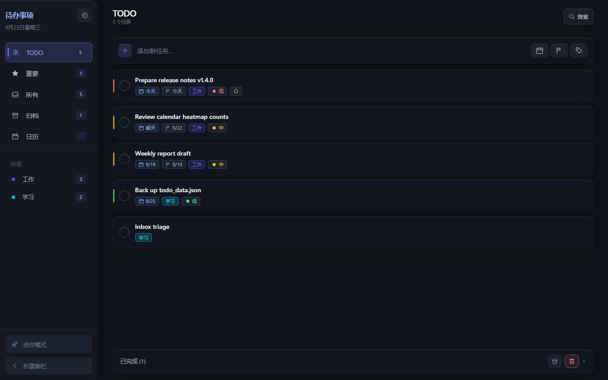
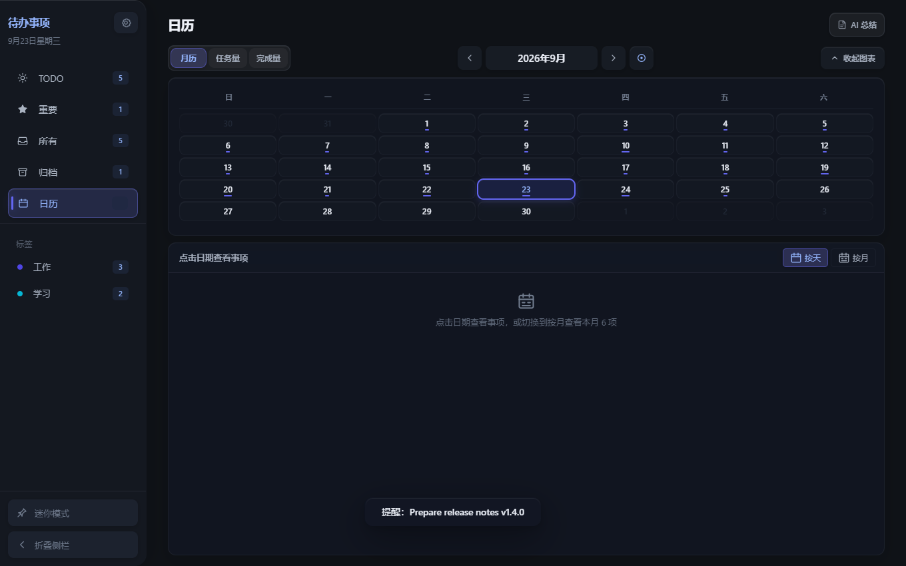
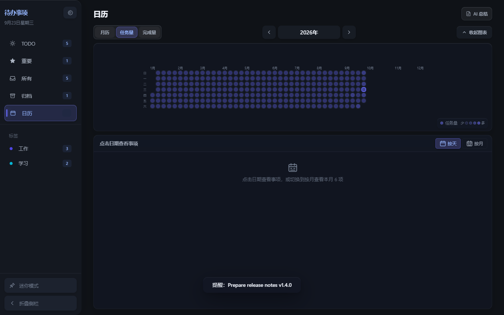
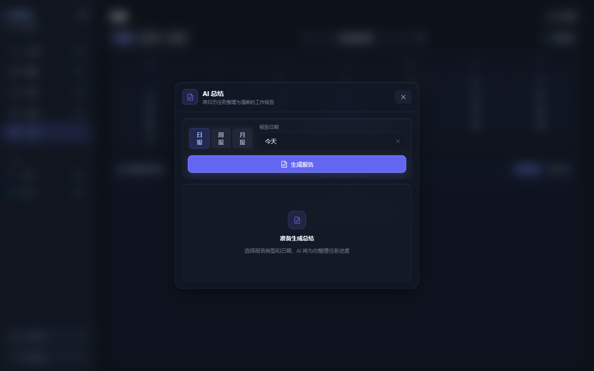
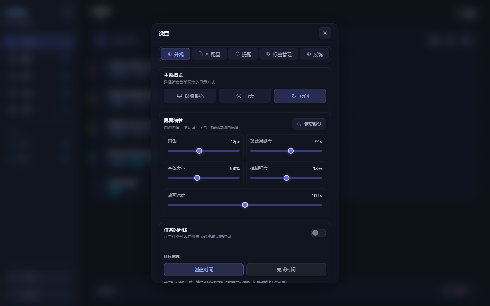

<div align="center">


# TODO Tools


**A lightweight todo app in vanilla JavaScript, CSS and HTML — no frontend framework. Runs in the browser via Vite and ships as a Windows desktop app via Neutralinojs.**

**[中文文档](./README.zh-CN.md)** · [Quick start](#quick-start) · [Features](#features) · [Screenshots](#screenshots)

</div>

---

## Screenshots

> Captured from the real app (`npm run dev`) with demo data. The desktop build adds mini mode, tray, and auto-update on top of the same UI.

| Task workspace | Calendar month view |
| --- | --- |
|  |  |
| Sidebar views (TODO / Important / All / Archive / Calendar), quick add with date–priority–tag presets, priority colors, tag counts, and a pinned "Completed" dock. | Month grid with 3-level workload bars, year/month jump, collapsible chart area, and a day/month detail list that stays in sync with the chart. |

| Yearly heatmaps | AI summary | Appearance settings |
| --- | --- | --- |
|  |  |  |
| Task-volume and completion heatmaps with a GitHub-style year grid and legend. | Streaming daily / weekly / monthly reports (monthly follows the calendar month) from your own API endpoint. | System / light / dark themes plus live radius, glass opacity, font scale, blur, and motion-speed controls. |

---

## Features

| Area | Highlights |
| --- | --- |
| Task management | Add, edit, delete, complete / uncomplete; priorities, tags, notes, start / due / reminder times; daily / weekly / monthly repeating reminders; archive / unarchive; batch cleanup of completed tasks; live search across title, notes, and tags |
| Fast paths | Quick add with date, priority, and tag presets (create-and-select new tags inline); right-click menu for Important / TODO / tag / reminder / archive; safe pointer-motion submenu area with the same status colors as the list |
| Layout | Completed list pinned to the bottom (hover to expand/collapse, draggable height); collapsible sidebar with persisted state and a compact `64px` mode; mini mode (`240 × 288`) with stats and quick add; desktop pin-on-top, tray, and hide-to-tray-on-close |
| Calendar | Month view + yearly task-volume and completion heatmaps; flip months, jump back to today, pick year/month directly; per-day detail in day/month mode with sticky group headers; counts always match the chart |
| Look & feel | Restrained frosted-glass office style (no gradient page background); SVG-only icon set (`src/icons.js`); per-container overlay scrollbars; keyboard operation (`↑↓` / `Enter` / `Space` / `Esc`) with ARIA roles throughout |
| Settings | Appearance, AI config, reminders, tag management, system; AI streaming reports; desktop auto-update from GitHub Releases (download → SHA-256 verify → allowlist replace → `.bak` rollback) |
| Data safety | AES-GCM file encryption when Web Crypto is available; legacy plaintext and legacy-encrypted formats still readable; corrupt files are never silently overwritten (writes pause + `.bak` backup); `localStorage` snapshot never stores `aiConfig.apiKey`; `_index` stays runtime-only |

---

## Quick start

```bash
npm install
npm run dev
```

Vite prints the local URL. In dev mode the app reads/writes the repo-root `data.json` through `/api/data`.

---

## Contents

- [Screenshots](#screenshots)
- [Features](#features)
- [Quick start](#quick-start)
- [Requirements](#requirements)
- [Commands](#commands)
- [Usage](#usage)
- [Tech stack](#tech-stack)
- [Project structure](#project-structure)
- [Data and persistence](#data-and-persistence)
- [Desktop build and release](#desktop-build-and-release)
- [AI setup](#ai-setup)
- [Calendar counting rules](#calendar-counting-rules)
- [UI conventions](#ui-conventions)
- [Known limitations](#known-limitations)
- [Contributing](#contributing)
- [License](#license)

---

## Requirements

- Node.js 18+
- npm
- Windows desktop packaging additionally needs a working Neutralino Windows runtime

On Windows PowerShell / cmd you can also use `npm.cmd`, e.g. `npm.cmd run build`.

## Commands

| Command | Description |
| --- | --- |
| `npm run dev` | Start the Vite dev server |
| `npm run build` | Build web production assets into `dist/` |
| `npm run preview` | Preview the production build |
| `npm test` | Run regression checks (task state, calendar heatmaps, AI URL, appearance, reminders, crypto compat) |
| `npm run neu:run` | Sync config, build, and launch the Neutralino desktop window |
| `npm run neu:build` | Build the desktop app and stamp Windows exe metadata |
| `npm run release -- <version>` | Pack the desktop build into a zip + SHA-256 file, print the `gh release create` command |

> `npm run release -- <version>` takes the version **without** a `v` prefix and it must match `package.json`.

## Usage

1. **Capture fast** — type in the quick-add bar; preset date, priority, and tag without leaving the keyboard.
2. **Triage by view** — TODO for today, Important for starred, All for everything, Archive for done-and-filed, Calendar for time-based review.
3. **Right-click for more** — mark Important/TODO, retag, set reminders, or archive without opening the editor.
4. **Review time in Calendar** — flip between month grid, task-volume heatmap, and completion heatmap; click any date for details (they never auto-switch the chart mode).
5. **Summarize with AI** — open *AI summary* from the calendar header, pick daily / weekly / monthly, generate, and copy the report.
6. **Tune the look** — Settings → Appearance adjusts theme, radius, glass opacity, font scale, blur, and motion speed live; the optional timeline rail shows created/completed times sorted either way.

## Tech stack

| Item | Technology |
| --- | --- |
| Build tool | Vite `^6.3.5` |
| Desktop runtime | Neutralinojs `6.7.0` |
| Neutralino CLI | `@neutralinojs/neu ^11.7.1` |
| Language | Vanilla JavaScript (ES Modules) |
| Styling | Vanilla CSS |
| Desktop packaging | Neutralinojs + `rcedit` |
| Data storage | JSON file + `localStorage` fallback snapshot |

## Project structure

```text
TODO/
├── index.html
├── package.json
├── app.config.json             # App name, window and mini-mode config (source of truth)
├── neutralino.config.json      # Neutralino runtime config (generated by sync script)
├── vite.config.js              # Vite build and asset-copy config
├── server-plugin.js            # Dev-only /api/data read/write endpoints
├── scripts/
│   ├── check-state.js          # Main regression checks
│   ├── check-build-output.js   # Guards the desktop output dir before building
│   ├── ensure-neutralino.js    # Checks/prepares the Neutralino runtime
│   ├── sync-config.js          # Syncs version + window config
│   ├── patch-exe.js            # Stamps Windows exe metadata
│   └── release.js              # Packs release zip + SHA-256, prints publish command
├── public/
│   ├── neutralino.js
│   ├── icon.svg                # Web icon source
│   └── icon.png                # Native-compat resource for Neutralino/Windows
├── docs/
│   └── assets/                 # Real app screenshots used by this README
└── src/
    ├── main.js                 # Entry point, tray and desktop init
    ├── app.js                  # Data, state and view assembly
    ├── eventBus.js             # In-app event subscribe/dispatch
    ├── selectors.js            # Filtering, counting and sorting
    ├── runtimeIndex.js         # Task runtime index and search matching
    ├── renderTodoItem.js       # Task list item rendering
    ├── calendar.js             # Calendar views
    ├── detail.js               # Task edit panel
    ├── datePicker.js           # Date and datetime pickers
    ├── glassSelect.js          # Shared glass dropdown component
    ├── quickAddPopup.js        # Quick date/priority/tag menus
    ├── contextMenu.js          # Context menu rendering
    ├── contextMenuConfig.js    # Context menu definitions
    ├── settings.js             # Settings and tag management
    ├── aiSummary.js            # AI summaries
    ├── reminder.js             # Reminder checks and notifications
    ├── windowsToast.js         # Windows native notification registration/sending
    ├── miniMode.js             # Desktop mini mode
    ├── miniSnap.js             # Mini-mode top snap and auto-collapse
    ├── donePanelResize.js      # Completed-panel drag resizing
    ├── timeline.js             # Timeline settings normalization and sorting
    ├── updater.js              # Desktop auto-update (check/download/verify/replace/rollback)
    ├── overlay.js              # Shared overlay and dialogs
    ├── overlayScrollbars.js    # Per-container overlay scrollbars
    ├── glassTooltip.js         # Shared glass tooltip
    ├── ripple.js               # Button press feedback
    ├── icons.js                # Unified SVG icon library and render helpers
    ├── shared.js               # Shared runtime helpers (tags, env detection)
    ├── theme.js                # Theme switching
    ├── uiPreferences.js        # Appearance normalization and CSS variables
    ├── style.css               # Global styles and glass design tokens
    └── utils/
        ├── aiApi.js            # AI URL normalization and endpoint completion
        ├── crypto.js           # File encryption and compat reads
        ├── date.js
        ├── focus.js
        ├── html.js
        └── id.js
```

## Data and persistence

Storage is picked per environment:

1. Neutralino desktop reads/writes `todo_data.json` in the program directory.
2. Vite dev reads/writes repo-root `data.json` via `/api/data`.
3. Otherwise the browser `localStorage` snapshot `todo_app_data` is used.

Files use AES-GCM encryption when Web Crypto is available; legacy plaintext JSON and the legacy encrypted format remain readable. If encryption is unavailable or fails, files fall back to plaintext — this lowers casual-exposure risk but is **not** a password vault.

<details>
<summary><strong>Data protection rules</strong></summary>

- Missing file → boots from the local fallback snapshot or empty data.
- Unparseable / undecryptable file → file overwrites pause so a corrupt file is never silently replaced with empty data.
- Desktop backs up abnormal files to timestamped `.bak` files when possible.
- The `localStorage` snapshot never stores `aiConfig.apiKey`; desktop/dev file snapshots keep the full AI config.
- The internal `_index` is runtime-only and never persisted.

</details>

<details>
<summary><strong>Data model</strong></summary>

```json
{
  "todos": [
    {
      "id": "unique id",
      "title": "task title",
      "desc": "notes",
      "priority": "high | medium | low | none",
      "tag": "tag name",
      "startTime": null,
      "endTime": null,
      "reminder": null,
      "reminderRepeat": "none | daily | weekly | monthly",
      "todo": true,
      "important": false,
      "done": false,
      "doneAt": null,
      "archived": false,
      "archivedAt": null,
      "createdAt": 1700000000000
    }
  ],
  "timeline": {
    "enabled": false,
    "sortBy": "created | completed"
  },
  "tags": ["work", "study"],
  "aiConfig": {
    "apiUrl": "",
    "apiKey": "",
    "model": "",
    "customPrompt": ""
  },
  "theme": "auto | light | dark",
  "uiStyle": {
    "radius": 12,
    "glassOpacity": 72,
    "borderStrength": 0,
    "fontScale": 100,
    "blur": 18,
    "motionSpeed": 100
  },
  "sidebarMini": false
}
```

</details>

## Desktop build and release

```bash
npm run neu:build
```

The build:

1. Syncs the version from `package.json` into `neutralino.config.json`.
2. Syncs window size, title, and binary name from `app.config.json`.
3. Builds Vite assets and produces the Neutralino app.
4. Stamps the Windows exe product name, version, and copyright via `rcedit`.

Desktop output lives in `dist/todo-tools/`. For distribution, keep the exe and `resources.neu` in the same directory.

### Release and auto-update

```bash
npm run neu:build
npm run release -- 1.2.0
```

This produces:

- `release/todo-tools-win_x64.zip` — release package with exe + `resources.neu`
- `release/todo-tools-win_x64.zip.sha256` — SHA-256 checksum file

Then run the printed `gh release create v1.2.0 ...` command to create the GitHub Release (tag `v<version>`). The desktop *System → Software update* page checks for new versions via `releases/latest`, downloads the zip, verifies it against `.sha256`, then replaces only the allowlisted exe + `resources.neu` files — restoring from `.bak` backups on failure. Missing releases (404), rate limits (403/429), and network errors each get a distinct message. The default repo is `PatrickStar-CN/TODO`, overridable via `update.repo` in `app.config.json`.

### Window sizes

Sizes live in `app.config.json` and are synced into the Neutralino config at build time:

| Mode | Default | Minimum |
| --- | --- | --- |
| Main window | `1100 × 700` | `800 × 500` |
| Mini mode | `240 × 288` | `220 × 220` |

Mini mode enables pin-on-top, frameless chrome, and a drag region; exiting restores the main window size, frame, and centered position.

## AI setup

Summaries are generated through a user-configured endpoint. You own the URL, model name, and credentials; browsers additionally need the endpoint to allow cross-origin requests from your origin. Do not store sensitive API keys in shared machines or shared data files.

The API URL is normalized at request time:

- Ends with `/v1` → `/chat/completions` is appended.
- Already contains `/chat/completions` → kept as-is.
- Any other custom address → kept as-is.
- Query string and fragment are preserved.

Example:

```text
https://api.example.com/v1
→ https://api.example.com/v1/chat/completions
```

## Calendar counting rules

- Month view renders the full date grid of the current month, keeping adjacent-month navigation.
- Task-volume heatmap counts by task coverage dates: multi-day tasks count on every covered day (inclusive); start-only tasks count on the start day; due-only tasks span creation → due; dateless tasks use the completion or creation day.
- Task-mode details share the heatmap's coverage rules, so the selected day's count matches the list below.
- Completion heatmap counts by `doneAt`; its details filter the same way.
- Switching between month / task-volume / completion refreshes the title, items, and empty state for the selected date immediately.
- Month details follow the same per-mode rules: month/task modes aggregate deduplicated coverage, completion mode filters `doneAt` by month.
- Color depth encodes volume; selected-day and today states always stay legible.
- Month and heatmap cells keep `data-date`, keyboard selection, tooltips, and ARIA descriptions.
- `calendarMode` and chart-collapse state are runtime-only and never persisted.

## UI conventions

New or changed UI should follow these rules.

<details>
<summary><strong>Material and theme</strong></summary>

- Use theme and glass variables from `src/style.css`; never hardcode pure white/black control backgrounds.
- Check every button, input, menu, and state element in light, dark, and follow-system themes.
- Charts, lists, and main views should blend into the background; avoid nested opaque blocks except for necessary dividers.
- Express hover / active / pressed / disabled via background, border, color, shadow, and subtle scale.

</details>

<details>
<summary><strong>Appearance linkage</strong></summary>

- Structural containers: `--ui-radius` / `--ui-radius-lg`.
- Buttons, inputs, regular controls: `--ui-radius-sm`.
- Tags, badges, menu items, compact date cells: `--ui-radius-xs`.
- Dots, priority dots, and round check states stay round (explicit circle semantics).
- Opacity, font, and blur use `--ui-glass-opacity`, `--ui-font-scale`, `--ui-glass-blur`, `--ui-glass-blur-light`.
- `--ui-border-strength` is fixed at `0%`; new components must not add a border-strength control.
- Animation durations use `--motion-fast` / `--motion-normal` / `--motion-panel`, scaled by the global motion-speed setting.
- Do not reintroduce fixed `6px` / `8px` / `10px` structural radii in new components.

</details>

<details>
<summary><strong>Icons, buttons, layout, motion, focus</strong></summary>

- Icons come from `src/icons.js`: `data-icon` for static markup, `iconSvg()` for dynamic templates, `createIcon()` / `setIcon()` for DOM updates.
- Never use emoji, character arrows, or character crosses as UI icons.
- Icon buttons are flex-centered with `title` or `aria-label`; reuse the existing button hierarchy and press feedback.
- Top-right view actions align with the title/content edges at a uniform height; task lists reuse the main list's complete/delete/move/zoom motion.
- Scroll regions under sticky headers keep top spacing; custom scrollbars live inside their own scroll container, never as a global `body` overlay.
- Motion is short and restrained, honoring `prefers-reduced-motion`; check the `800 × 500` minimum desktop window.
- No purple glow outlines as default focus; express keyboard state with theme-adapted border/background/text so selection stays intact.
- Interactive dates, menus, and tabs keep semantic roles, keyboard operation, and accurate ARIA state.

</details>

## Known limitations

> [!NOTE]
> Desktop reminders, tray, and auto-update depend on Windows, the Neutralino environment, and reachability of GitHub Releases.

- Mini-mode pin-on-top, dragging, and frameless chrome are desktop-only.
- The web build is not an offline PWA.
- Production static preview has no dev-server `/api/data` endpoint, so it uses the `localStorage` fallback.
- The file-encryption key includes current-device environment info — keep a readable original or export plaintext before migrating encrypted data across devices.

## Contributing

Contributions are welcome. Before submitting, please run at least:

```bash
npm test
npm run build
git diff --check
```

When adding or fixing business rules, extend the regression assertions in `scripts/check-state.js` accordingly. Keep changes minimal and scoped; follow the existing vanilla ES-module style (2-space indent, single quotes, semicolons).

## License

This repository currently ships without a `LICENSE` file (`"private": true` in `package.json`), so all rights are reserved by default. If you plan to reuse or distribute this code, please contact the author first.

---

<div align="center">

Built with vanilla JavaScript · Vite · Neutralinojs

</div>
